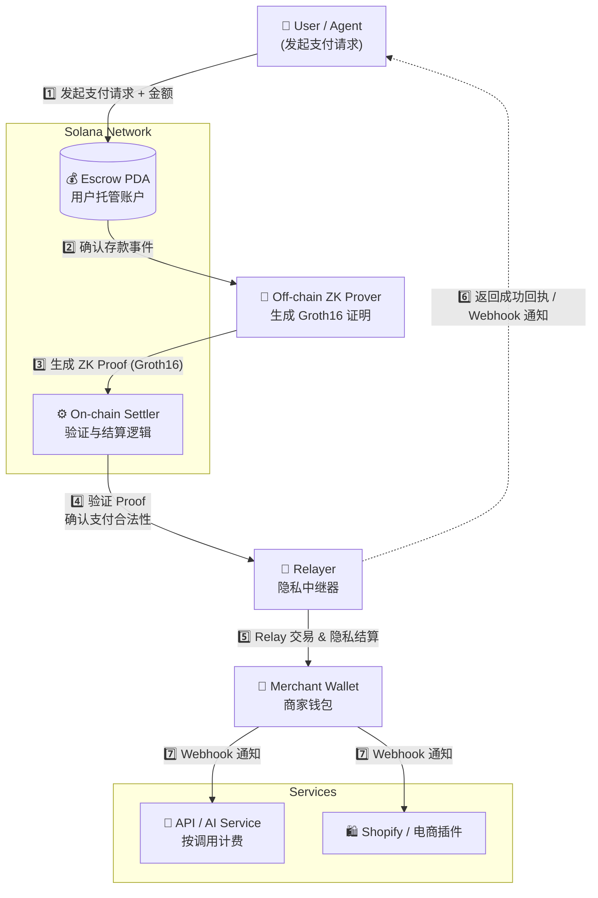

```mermaid
flowchart TD
    %% 定义节点和连接
    U["👤 User / Agent<br/>(发起支付请求)"]
    ZK["🧮 Off-chain ZK Prover<br/>生成 Groth16 证明"]
    ESCROW[("💰 Escrow PDA<br/>用户托管账户")]
    SETTLER["⚙️ On-chain Settler<br/>验证与结算逻辑"]
    RELAYER["🔁 Relayer<br/>隐私中继器"]
    MERCHANT["🏪 Merchant Wallet<br/>商家钱包"]
    API["🧠 API / AI Service<br/>按调用计费"]
    SHOP["🛍️ Shopify / 电商插件"]

    %% 链上组件分组
    subgraph "Solana Network"
        ESCROW
        SETTLER
    end

    %% 服务分组
    subgraph "Services"
        API
        SHOP
    end

    %% 数据与资金流
    U -->|"1️⃣ 发起支付请求 + 金额"| ESCROW
    ESCROW -->|"2️⃣ 确认存款事件"| ZK
    ZK -->|"3️⃣ 生成 ZK Proof (Groth16)"| SETTLER
    SETTLER -->|"4️⃣ 验证 Proof<br/>确认支付合法性"| RELAYER
    RELAYER -->|"5️⃣ Relay 交易 & 隐私结算"| MERCHANT
    RELAYER -.->|"6️⃣ 返回成功回执 / Webhook 通知"| U
    MERCHANT -->|"7️⃣ Webhook 通知"| API
    MERCHANT -->|"7️⃣ Webhook 通知"| SHOP
```
